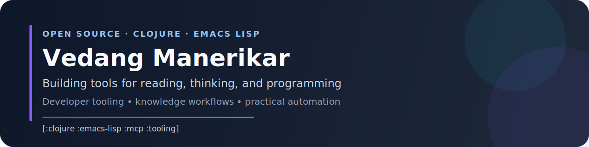

  

# Hi, I'm Vedang 👋

I like building practical tools for developers and knowledge workers. A lot of my open-source work lives at the intersection of **Emacs**, **Clojure**, **knowledge workflows**, and **developer ergonomics**. More recently, I've been exploring **agent-oriented tooling**.

**Current**: [Unravel.tech](https://unravel.tech) · **Alum:** [Recurse Center](https://www.recurse.com/) · **Previously:** [Helpshift](https://www.helpshift.com/)

## Featured work

### Agent tooling & practical automation

- 🤖 **[agents](https://github.com/vedang/agents)** — My agent harness configuration, extensions, skills, and workflow setup. `⭐ 10`
- 📚 **[pi-learn-stuff](https://github.com/vedang/pi-learn-stuff)** — Pi extension that adds a concise lessons block to assistant responses with selective persistence to `AGENTS.md`.
- 🔍 **[pi-prompt-history](https://github.com/vedang/pi-prompt-history)** — Ctrl-R style prompt-history search extension for pi.
- 🧠 **[pi-quizme](https://github.com/vedang/pi-quizme)** — Test your understanding of coding sessions with auto-generated quizzes about recent changes.
- 🧹 **[pi-simplify-code](https://github.com/vedang/pi-simplify-code)** — Automatically triggers code simplification after non-markdown code changes.
- 🔌 **[pi-custom-provider-zai](https://github.com/vedang/pi-custom-provider-zai)** — Custom provider extension exposing ZAI-family models from two upstream hosts.
- 🔄 **[pi-ralph-loop](https://github.com/vedang/pi-ralph-loop)** — Ralph-style autonomous planning loops for pi.

### Emacs & knowledge workflows

- 📄 **[pdf-tools](https://github.com/vedang/pdf-tools)** — Emacs support library for PDF files. `⭐ 806`
- 🎨 **[alabaster-themes](https://github.com/vedang/alabaster-themes)** — Minimal light and dark GNU Emacs themes inspired by the original Alabaster palette. `⭐ 24`
- ⚙️ **[unravel-team/emacs](https://github.com/unravel-team/emacs)** — GNU Emacs configuration for Emacs 30 and above. `⭐ 16`
- 📝 **[denote-publish](https://github.com/vedang/denote-publish)** — Publish Denote notes to Markdown while keeping front matter intact.

### Clojure libraries & backend tooling

- 🔌 **[mcp-clojure-sdk](https://github.com/unravel-team/mcp-clojure-sdk)** — A Clojure SDK for creating MCP servers (and eventually clients). `⭐ 61`
- 🗃️ **[clj_fdb](https://github.com/vedang/clj_fdb)** — Thin Clojure wrapper around the Java FoundationDB API. `⭐ 27`
- 🧠 **[cljc-fsrs](https://github.com/open-spaced-repetition/cljc-fsrs)** — Clojure(Script) implementation of FSRS v4 for spaced repetition. `⭐ 13`
- 🪵 **[clj-logging](https://github.com/vedang/clj-logging)** — Template project showing how to wire Log4J2 cleanly across transitive dependencies.
- 📐 **[metaprogramming](https://github.com/unravel-team/metaprogramming)** — Cross-language metaprogramming conventions and Makefile templates for Clojure, Go, Python, and TypeScript projects.

<strong>Unmaintained projects that I'm proud of</strong>

<ul>
  <li>🎨<strong><a href="https://github.com/vedang/pi-antigravity-image-gen">pi-antigravity-image-gen</a></strong> — Pi package adding a <code>generate_image</code> tool backed by Google Antigravity credentials with Vertex AI-first fallback.</li>
  <li>🌱 <strong><a href="https://github.com/vedang/bloomclj">bloomclj</a></strong> — Bloom filter implementation in Clojure. <code>⭐ 20</code></li>
  <li>🧹<strong><a href="https://github.com/vedang/nginx-nonewlines">nginx-nonewlines</a></strong> — Nginx module that strips newline characters from served HTML. <code>⭐ 18</code></li>
  <li>🐍<strong><a href="https://github.com/vedang/python-emacs">python-emacs</a></strong> — Emacs setup and third-party packages for a stronger Python workflow. <code>⭐ 11</code></li>
  <li>👷<strong><a href="https://github.com/vedang/emacs-up">emacs-up</a></strong> — My long-running personal Emacs configuration. <code>⭐ 33</code></li>
  <li>🗂️ <strong><a href="https://github.com/vedang/org-mode-crate">org-mode-crate</a></strong> — Plug-and-play Org Mode configuration built from a real day-to-day workflow. <code>⭐ 23</code></li>
  <li>🔧 <strong><a href="https://github.com/vedang/bb-scripts">bb-scripts</a></strong> — A collection of Babashka scripts for day-to-day automation. <code>⭐ 12</code></li>
  <li>📚 <strong><a href="https://github.com/vedang/csaoid">csaoid</a></strong> — Cheat sheets and other interesting documents I keep reaching for. <code>⭐ 21</code></li>
</ul>

## Connect

- 🌐 Website: [vedang.me](https://vedang.me/)
- 🐦 X: [@vedang](https://x.com/vedang)
- 🐘 Masto: [@vedang](https://fosstodon.org/@vedang)
- 💻 GitHub: [github.com/vedang](https://github.com/vedang)